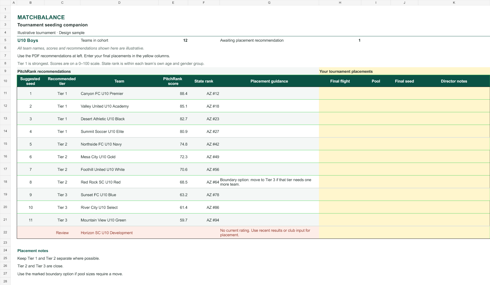
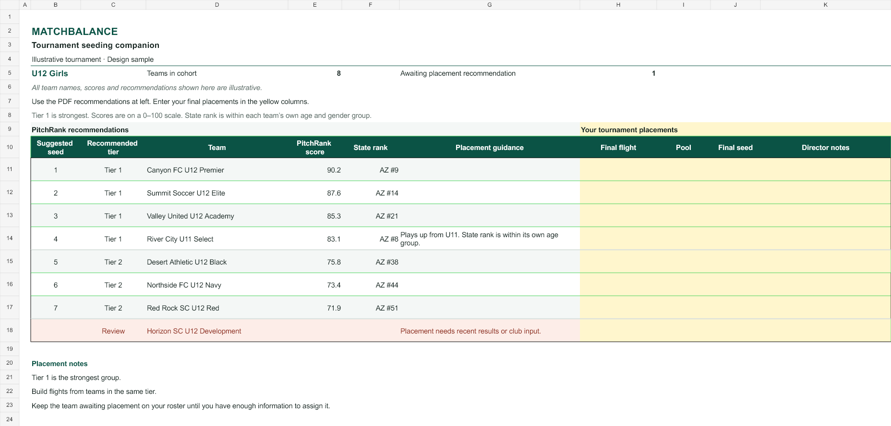

# MatchBalance director workbook design

[Download the Excel design sample](director-workbook-sample.xlsx).

This workbook is the editable companion to the tournament director's PDF.
It contains two illustrative cohort tabs, U10 Boys and U12 Girls. All names,
scores, ranks, and recommendations are sample data.

Each cohort presents suggested seeds, recommended tiers, team names,
PitchRank scores, state ranks, and placement guidance. Yellow columns let
the director enter the final flight, pool, seed, and notes while retaining
the recommendations. Tables support sorting and filtering, with frozen
headers and team names. Teams awaiting placement remain visible without
a suggested seed.

The design is not connected to the Streamlit export yet. When implemented,
the workbook should use the same selected cohorts, team order, rating
snapshot, tier decisions, placement notes, and draft status as the PDF.
Keep pricing, matching diagnostics, and database identifiers out of the
director's workbook.

## U10 Boys

## U12 Girls

